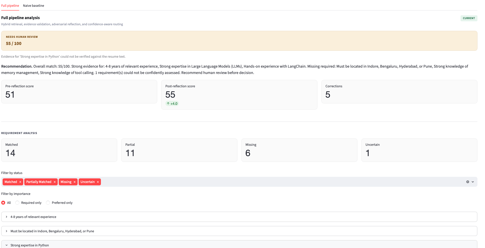
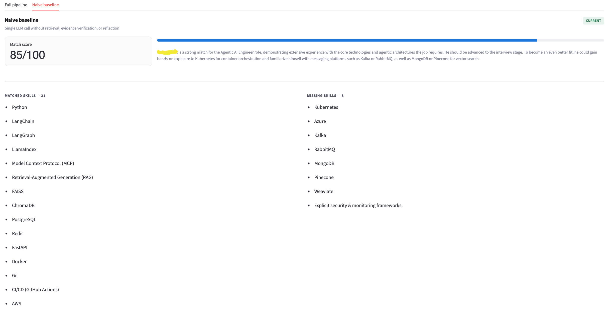

# Resume → Job Description Matcher

An agentic resume analysis system with hybrid RAG, evidence validation, adversarial reflection, and confidence routing.


## Application

### Full pipeline



### Naive baseline



## What it does

1. **Processes** — uses Docling layout analysis, OCR, and hybrid chunking to preserve resume structure
2. **Plans** — extracts discrete requirements from the job description
3. **Retrieves** — finds the most relevant resume sections per requirement (BM25 + cosine similarity + RRF + rerank)
4. **Scores** — evaluates each requirement against verbatim evidence
5. **Validates** — checks every evidence quote is a real substring of the resume
6. **Reflects** — adversarial critic corrects both inflated and missed scores, and every correction must pass the same evidence check
7. **Routes** — accept / needs_review / reject with a stated reason. One missing required qualification rejects; anything the system could not assess escalates rather than rejects

## Setup

```bash
git clone https://github.com/jkarthi-6666/resume-jd-matcher.git
cd resume-jd-matcher

conda create -n rag python=3.11 -y
conda activate rag
pip install -r requirements.txt

cp .env.example .env
# Edit .env — add NVIDIA_API_KEY (get one at build.nvidia.com)
```

Docling downloads its local document-layout and OCR model artifacts on the
first PDF conversion. Pre-warm that cache when building a production image so
the first user request does not pay the model initialization cost.

## Run

```bash
streamlit run app.py
```

Upload a PDF resume, paste a job description, click Analyse.

## Tests

```bash
pytest tests/ -v
```

The test suite needs no API key or network — every model and embedding call is
mocked at the provider-agnostic seam (`src.llm.call`, `src.embeddings.get_embeddings`).
`tests/conftest.py` installs an autouse guard that fails any test which reaches
a real provider, so a mock patched at the wrong layer surfaces immediately
instead of quietly billing a live API.

## Evaluation

The repository includes five privacy-safe synthetic resumes with labeled scores
and expected verdicts. Regenerate their PDFs and validate the dataset without
calling a model provider:

```bash
python evaluation/generate_synthetic_pdfs.py
python evaluation/run_evaluation.py --validate-only
```

Run a single inexpensive smoke case before evaluating the full set:

```bash
python evaluation/run_evaluation.py --mode full --case-id case_001 \
  --output evaluation/case_001-results.json \
  --summary evaluation/case_001-results.md
```

Omit `--case-id` to run all cases. The evaluator saves complete machine-readable
reports and a Markdown metrics summary while isolating failures per case.

## Configuration

All model and threshold settings are in `.env`. See `.env.example` for the full list.

| Variable | Default | Notes |
|---|---|---|
| `LLM_PROVIDER` | `nvidia` | `nvidia`, `openai`, `anthropic`, or `gemini` |
| `NVIDIA_API_KEY` | — | Required under the default provider |
| `NVIDIA_BASE_URL` | `https://integrate.api.nvidia.com/v1` | OpenAI-compatible endpoint |
| `PLANNER_MODEL` | `openai/gpt-oss-120b` | JD → requirements |
| `RERANKER_MODEL` | `openai/gpt-oss-120b` | Rerank retrieved chunks |
| `SCORER_MODEL` | `openai/gpt-oss-120b` | Per-requirement judgment |
| `REFLECTOR_MODEL` | `openai/gpt-oss-120b` | Adversarial critic |
| `EMBED_PROVIDER` | matches `LLM_PROVIDER` | Falls back to `gemini` for `anthropic` |
| `EMBED_MODEL` | `nvidia/nv-embedqa-e5-v5` | Per-provider default |
| `CONFIDENCE_FLOOR` | `0.7` | Below this on a required item, escalate to review |
| `REQUIRED_ACCEPT_SCORE` | `0.75` | At or above this, a requirement counts as met |
| `PARTIAL_MATCH_SCORE` | `0.25` | Below this, a required item is missing and rejects |
| `RERANK_TOP_N` | `3` | Chunks passed to the scorer |

Switching `LLM_PROVIDER` requires the matching key (`OPENAI_API_KEY`,
`ANTHROPIC_API_KEY`, `GEMINI_API_KEY`) — `validate_config()` checks this at
startup. Anthropic has no embedding endpoint, so `EMBED_PROVIDER` falls back to
`gemini` and needs `GEMINI_API_KEY` set alongside it.

## Project structure

```
src/
  schemas.py       Pydantic models (Literal types throughout)
  docling_processor.py  PDF → Docling document → structure-aware chunks
  parser.py        Legacy PyMuPDF extractor (not on the active pipeline path)
  chunker.py       Legacy regex chunker (not on the active pipeline path)
  embeddings.py    In-memory cosine-similarity vector index
  retriever.py     BM25 + cosine vector retrieval + RRF
  reranker.py      LLM rerank
  planner.py       JD → requirements (cached)
  scorer.py        Per-requirement scoring
  validate.py      Evidence checks, status, guarded confidence calibration
  calculator.py    Weighted score (Python)
  reflector.py     Adversarial critic
  router.py        Verdict routing
  pipeline.py      Orchestration
  llm.py           Provider wrapper
```

## Known limitations

See [FAILURES.md](FAILURES.md) for an honest list of what breaks.

## Architecture

See [docs/architecture.md](docs/architecture.md).
